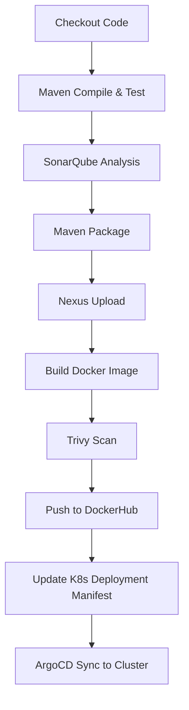

# 🚀 Ultimate CI/CD Pipeline  

This repository demonstrates a **Complete CI/CD Pipeline** using **Jenkins, Maven, SonarQube, Nexus, Docker, Trivy, ArgoCD, and Kubernetes**.  

The pipeline automates:  
- Source code checkout from GitHub  
- Build & test with Maven  
- Static code analysis with SonarQube  
- Artifact upload to Nexus  
- Docker image build & security scan with Trivy  
- Docker image push to DockerHub  
- Deployment manifest update & push back to GitHub (GitOps)  
- Notifications on pipeline success/failure  

---

## 🛠️ Pipeline Stages  

1. **Checkout**  
   - Clones the repository from GitHub.  

2. **Maven Compile & Test**  
   - Compiles Java source code and runs unit tests.  

3. **SonarQube Analysis**  
   - Runs static code quality analysis using configured SonarQube server.  

4. **Maven Package**  
   - Packages the Spring Boot application into a JAR.  

5. **Upload Artifact to Nexus**  
   - Deploys the packaged JAR to a Nexus repository.  

6. **Build Docker Image**  
   - Builds Docker image for the application:   

7. **Trivy Scan**  
   - Scans the Docker image for vulnerabilities and generates an HTML report.  

8. **Push Docker Image**  
   - Pushes the Docker image to **DockerHub**.  

9. **Update Deployment File**  
   - Updates the Kubernetes deployment manifest with the latest image tag.  
   - Commits & pushes changes back to GitHub (GitOps approach for ArgoCD).  

10. **Post Actions**  
    - Sends email notification on **success** or **failure** of the pipeline.  

---

## ⚙️ Jenkins Configuration  

- **Tools**:  
  - Maven (configured as `maven-local` in Jenkins Global Tool Config)  

- **Credentials**:  
  - `docker-cred` → DockerHub credentials  
  - `github` → GitHub Personal Access Token (with repo access)  
  - `global-settings` → Managed Maven settings.xml for Nexus  

- **SonarQube**:  
  - Configure in Jenkins as `SonarQubeServer`  

---

## 📂 Project Structure  

```
ultimate-cicd-pipeline/
│
├── git-java-maven-sonar-trivy-nexus-argocd-k8s/
│   ├── spring-boot-app/              # Source code
│   └── spring-boot-app-manifests/    # Kubernetes manifests
│
├── Jenkinsfile                       # CI/CD pipeline definition
└── README.md                         # Project documentation
```

---

## 🚦 Running the Pipeline  

1. Configure Jenkins with required tools and credentials.  
2. Create a new pipeline job pointing to this GitHub repo.  
3. Trigger the pipeline — it will:  
   - Build, test, scan, push Docker image  
   - Update Kubernetes manifests  
   - Notify via email  

---

## 📊 Reports  

- **Trivy Scan Report** → `trivy-image-report.html`  
- **SonarQube Reports** → Available on SonarQube Dashboard  

---

## 📬 Notifications  

- On success → email sent with build number & Docker image details.  
- On failure → email sent with error details & link to Jenkins logs.  

---

## 🖼️ CI/CD Workflow  



---

## 🔑 Tech Stack  

- **CI/CD**: Jenkins  
- **Build Tool**: Maven  
- **Code Quality**: SonarQube  
- **Artifact Repository**: Nexus  
- **Containerization**: Docker  
- **Security**: Trivy  
- **GitOps Deployment**: ArgoCD + Kubernetes